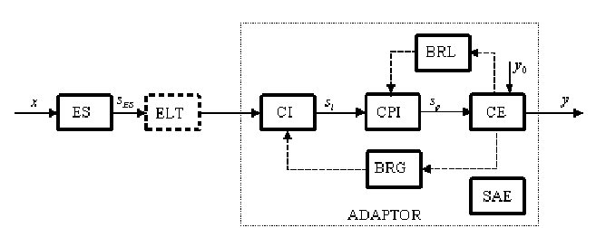

# Elemente componente tipice ale traductoarelor

## Elementele sensibile ale traductoarelor electrice

Sunt elemente care intra in contact nemijlocit cu marimea de proces, deci diversitatea marimii de proces se regaseste in cea a elementelor sensibile.

### Clasificare:

1. dupa principiul conversiei marimii de masurat
   
   - parametrice
   
   - generatoare

2. dupa natura marimii de masurat
   
   - mecanice
   
   - termice
   
   - chimice
   
   - electrice

#### 1.

Elementele parametrice realizeaza conversia marimii de masurat intr-un element de circuit electric de tip rezistiv/inductiv/capacitiv - este nevoie de o sursa de activare externa pentru a le pune in evidenta.

**Elemente pasive**

Elementele generatoare au proprietatea ca poseda o energie proprie din care o mica parte este folosita in procesul de masurare.

Pentru elementele pasive rezistive ($R=\rho{l\over S}$) variatia rezistentei se poate pune in evidenta pe baza variatiei $\rho$, $l$ sau $S$ a firului.

Pe principiul diodei se construiesc senzori de temperatura integrati: $1\mu A/\degree C$, $1mV/\degree C$ cu $\varepsilon=\pm0.5\degree C$

Pentru elementele pasive inductive ($L=\frac{N^2}{\sum_{k=1}^n{l_k\over\mu_kS_k}}$) variatia inductantei poate fi obtinuta prin variatia $l$ (lungimea de camp magnetic), $\mu$ (permeabilitatea magnetica) sau S (sectiunea). Se construiesc traductoare cu miez mobil pentru deplasari liniare/unghiulare respectiv traductoare cu intrefier variabile in variante simple sau diferentiale.

Pentru elementele pasive capacitive ($C=\frac{\varepsilon S}{d}$) variatia capacitatii se obtine pe baza variatiei $\varepsilon$ (permitivitate), $S$ (suprafata activa) sau $d$ (distanta dintre armaturi).

**Elemente generatoare**

Semnalul obtinut are amplitudini mici ($\mu V$), iar rezistenta interna a sursei echivalente ($Z_s$) este, de cele mai multe ori, de valori ridicate, deci semnalul generat se preia cu amplificatoare instrumentale impreuna cu masuri sepciale de ecranare.

Functionarea elementelor generatoare are la baza o serie de legi/fenomene fizice cum ar fi:

- inductia electromagnetica: tensiunea la bornele unei bobine cu amplitudine dependenta de variatia fluxului prin bobina

- efectul piezoelectric: aparitia unei sarcini electrice spontane pe axa electrica la aplicarea unui efort pe axa mecanica

- efectul piroelectric: aparitia unei sarcini electrice la o variatie brusca de temperatura

- efectul Hall: aparitia unei tensiuni dependente de inductia magnetica

- efectul fotoelectric: fotodiode, fototranzistori

- efectul electrochimic: generarea unei diferente de potential intre doi electrozi plasati in solutie cu pH diferit

**Adaptoare electronice**

Preiau semnalul de la elementul sensibil si, prin transformari interne cu caracter liniar/neliniar, asigura semnalul electric calibrat din iesire.

Pentru elemente parametrice CI (circuit de intrare) este de forma unor porti logice lucrand in regim dezechilibrat.

Pentru elemente generatoare CI este de forma unor amplificatoare instrumentale care preiau semnalului din iesirea elementului sensibil.

CPI (circuit de prelucrarea intermediara) impreuna cu CE (convertor de iesire) si BRL/BRG (bloc de reactie locala/globala) prelucreaza iesirea CI si ofera in iesire o tensiune continua proportionala cu x, cu limitele de variatie alese de constructor.

CE realizeaza un semnal in iesire pe vaza surselor de alimentare suficient de puternic pentru a garanta performanta traductorului.

In aplicatii, traductoarele se pot conecta in urmatoarele conexiuni:

- pe 4 fire: 2 pentru alimentare si 2 pentru iesire: frecvent intalnita la traductoare inteligente conectate pe magistrala standardizata

- pe 3 fire: masa comuna intre alimentare si iesire

- pe 2 fire
